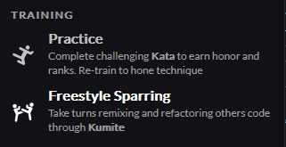
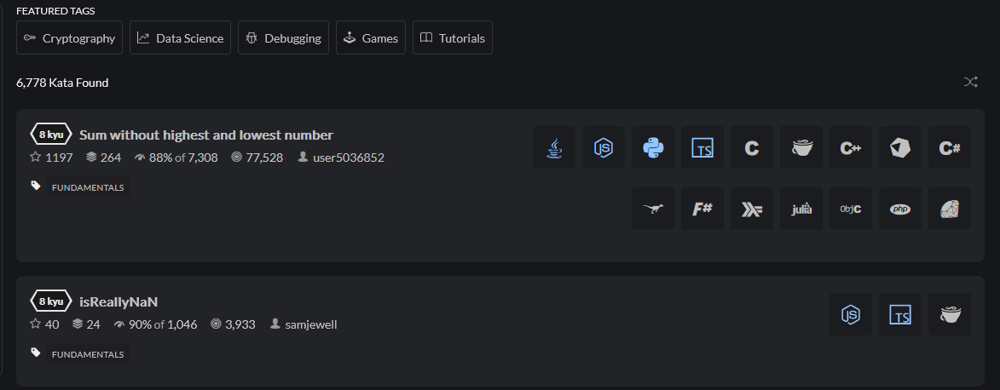
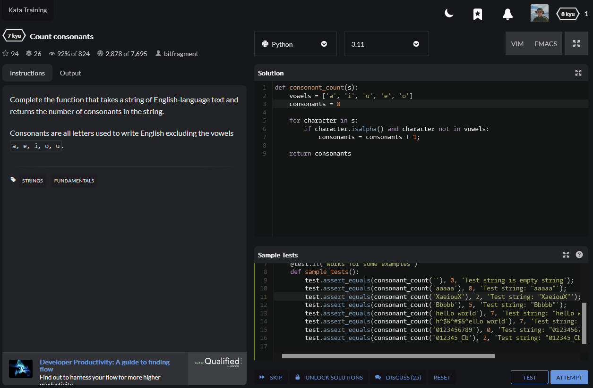
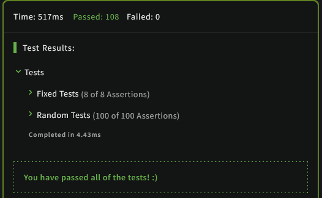

# Analiza CodeWars

## Opis

CodeWars jest platformą pełniącą rolę środowiska do rozwiązywania i dzielenia się zadaniami dla programistów. Nie jest ona nastawiona na przygotowania do rozmów kwalifikacyjnych, ale również nie jest stroną czysto edukacyjną. Użytkownicy, rozwiązując problemy, otrzymują punkty **kyu**, dzięki którym pną się w górę w dostępnych rankingach. Własne rozwiązania można udostępniać na forach i przekazywać do przeglądu innym użytkownikom do np. porad w jakości napisanego kodu.

## Zadania

### Tryby ćwiczeń

Dostępne są dwa tryby rozwiązywania zadań.

- **Practice:** samodzielne rozwiązywanie zadań nazywanych _Kata_
- **Freestyle Sparring:** turowe przerabianie kodu innych użytkowników

### Praktyka

W trybie **Practice** dostępne są zadania tworzone przez innych użytkowników. Można je rozwiazywać we wielu dostępnych językach przypisanych do danego zadania. Widoczny jest również stopień satysfakcji uzytkowników z danego zadania po jego rozwiązaniu oraz ogólna ilość przesłanych rozwiązań.

### Kolekcje

Możliwe jest stworzenie własnych kolekcji zadań i udostepnienie jej innym.

## Edytor

Edytorze widoczna jest treść zadania podana przez twórcę zadania.

Okno edycji rozwiązania posiada kolorowanie składni. Istniej możliwość zmiany języka rozwiązania razem ze zmianą wersji wybranego języka. Dostepna jest zmiana trybu edytora aby działał jak VIM lub EMACS. Dostępny jest tryb pełnoekranowy.

Testy są widoczne w oknie **Sample Tests** i można je dowolnie modyfikować, jednakże należy to robić w formie pisania kodu.

### Wykonanie testów

Po wciśnięciu przycisku _TEST_ wykonywane są przygotowane testy. Ich wyniki pokazane są w zakładce _Output_. Widać dokładnie które testy przeszły. W przybadku błędów pokazywana jest otrzymana i oczekiwana wartośc. Podany jest również czas wykonania testów.

### Wysłanie rozwiązania

Po wysłaniu rozwiązania przyciskiem _ATTEMPT_ kod sprawdzany jest również wieloma innymi testami _Random Tests_. Wyniki są zaprezentowane tak samo jak zwykłe testy.

