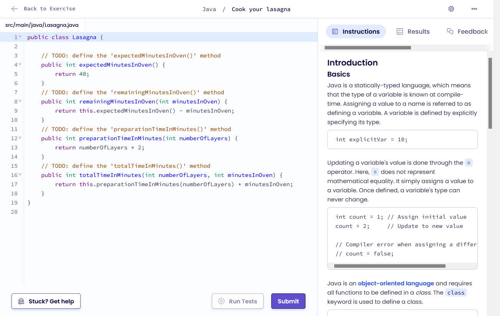

# Analiza Exercism

## Opis

Exercism jest platformą skupioną na nauce i ćwiczeniu programowania. Na stronie dostępne są ścieżki nauki do pozyskania wiedzy i praktyki o szczególnym języku. Na chwilę obecną można wybierać z 67 języków. Należą do nich te najbardziej znane jak Java, Python czy C, lecz można też wybierać mniej popularne takie jak Fortran, Elixir czy COBOL.

## Rozwiązywanie zadań

Jako że użytkownik uczy się wybranej ścieżki, dostępne zadania są odblokowywane razem z postępami w nauce.

### Wstęp do zadania

Po wybraniu zadania przed przystąpieniem do niego prezentowane jest użytkownikowi jakich konceptów nauczy się z tym ćwiczeniu oraz wstęp teoretyczny razem z treścią. Tutaj można też wybrać, czy chce się pisać zadanie w edytorze w przeglądarce, czy może przy użyciu własnego edytora z wykorzystaniem dostępnego interfejsu konsolowego (CLI).

### Edytor Exercism

Edytor oferuje kolorowanie składni adekwatne do wybranego języka. W panelu po prawej stronie dostępna jest potrzebna teoria i treść zadania. Kolejnych zakładkach można też zobaczyć rezultat przeprowadzonych testów, sposoby uzyskania pomocy oraz za opłatą dostęp do ChatGPT.

Przed wysałaniem rozwiązania do zatwierdzenia można wykonać przygotowane testy. Dopiero po pozytywnym wyniku we wszystkich testach można wysłać rozwiązanie.

Po wykonaniu zadania można wysłać prośbę o sprawdzenie rozwiązania pod kątem jakości napisanego kodu przez doświadczonego programistę.

## Rozwiązania społeczności

Własne rozwiązania można udostepniac społeczności. Możliwe jest wtedy naturalnie oglądanie rozwiązań innych użytkowników w zakładce _Community Solutions_.

## Podsumowanie

Exercism jest platformą przede wszystkim do własnej i spokojnej nauki języków programowania. Nacisk na znajomość algorytmów i struktór danych nie jest widoczny.
