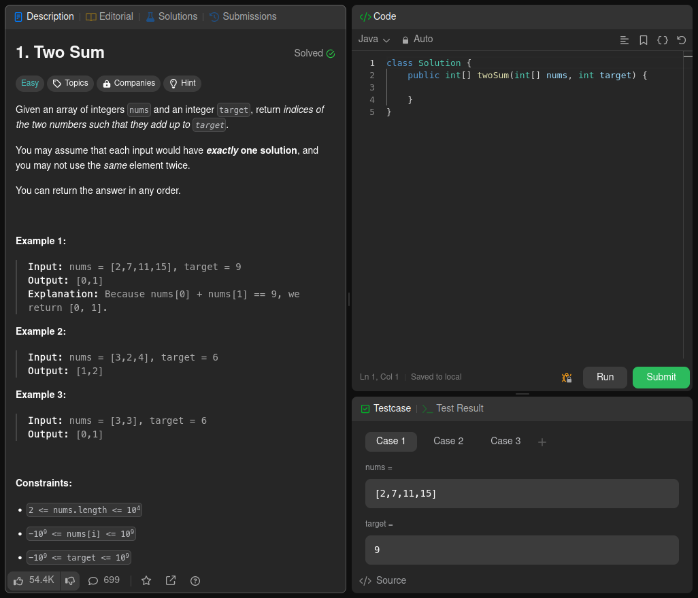
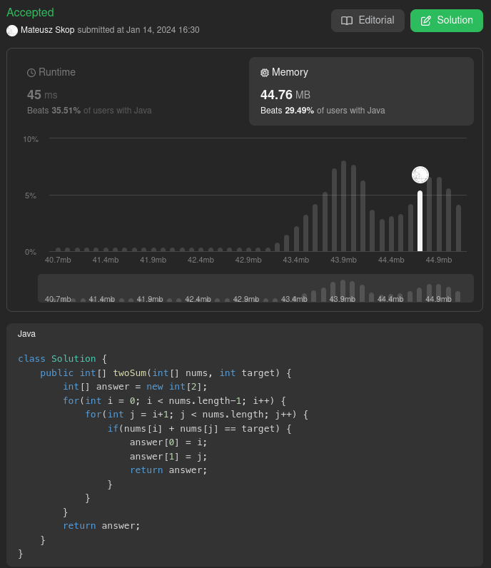
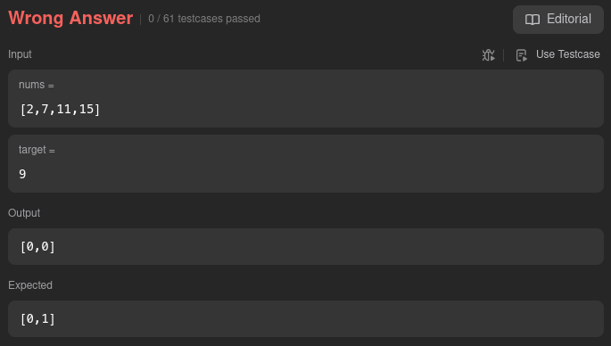
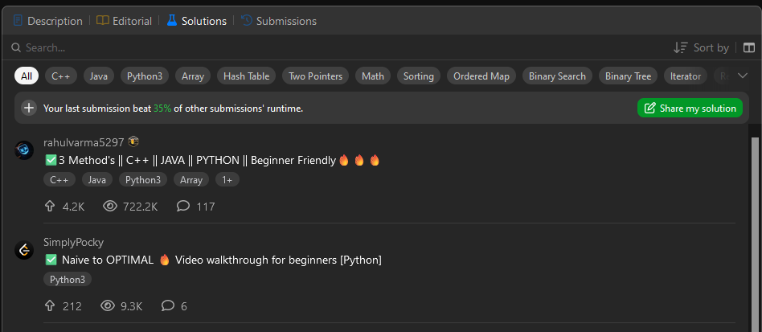
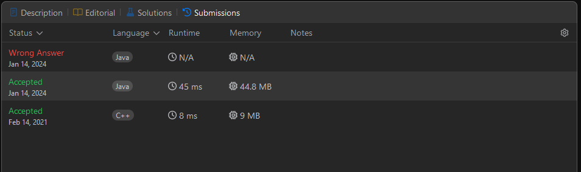
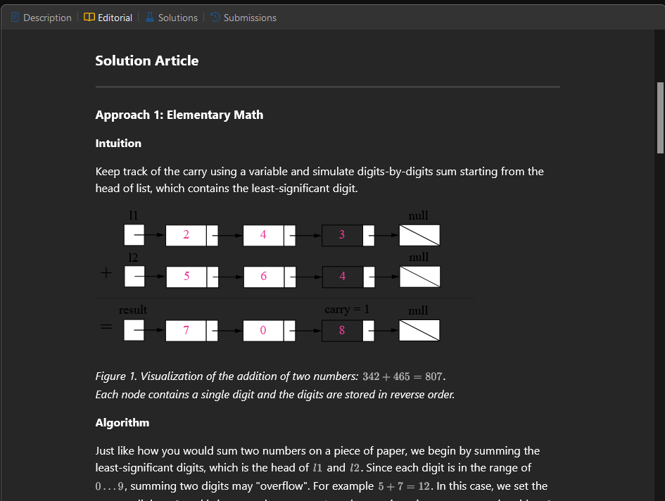
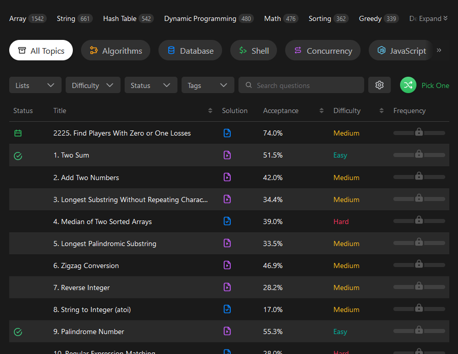
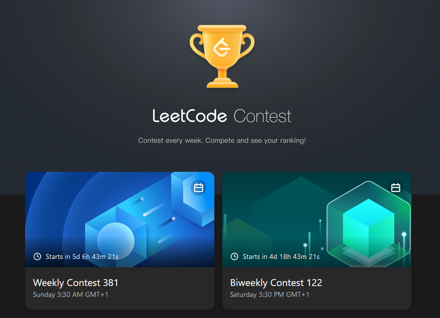

# Analiza LeetCode

## Opis serwisu

LeetCode jest jedną z najpopularniejszych platform oferujących zbiór zadań programistycznych z zakresu m.in. struktur danych i algorytmów. Obok pomocy do nauki programowania ważnym przeznaczeniem platformy jest przygotowywanie do rozmów kwalifikacyjnych obejmujących zadania algorytmiczne. LeetCode daje również dostęp do regularnych konkursów, w których zadania są ograniczone czasowo.

## Rozwiązywanie zadań

Każde dostępne zadanie posiada opis, przykłady wyników oraz informacje jakich danych wejściowych można się spodziewać. Edytor kodu pozwala wybrać język, w jakim użytkownik chce napisać zadanie. Elementy składni są odpowiednio kolorowane. Możliwe jest automatyczne formatowanie napisanego kodu.

Do własnego testowania można uruchamiać kod przyciaskiem _Run_. Wykonywane są wtedy wszystkie testy z sekcji _Testcase_. Testy te można rozszerzać o własne przypadki. Po wciśnięciu przycisku _Submit_ odpowiedź jest rejestrowana i testowana względem dużo więszej puli testów obejmującej przypadki skrajne. W odpowiedzi otrzymuje się informację, czy rozwiązanie zostało przyjęte jak również czas wykonania oraz zużycie pamięci. Dodatkowo otrzymuje się statystykę jak wysłane rozwiązanie prezentuje się na tle rozwiązań innych użytkowników.

W przypadku wystąpienia błędnych odpowiedzi wyświetlana jest informacja ile testów przeszło i przykład testu, na którym wystąpił błąd.

Dostępne jest również przejrzenie rozwiązań udostępnionych przez innch użytkowników.

Wszystkie swoje podejścia zapisane są w zakładce _Submissions_.

Możliwe jest również zapoznanie się z materiałem edukacyjnym w zakładce _Editorial_. Można znaleść tam również nagrania, które często można odblokować wykupując usługę _Premium_.

## Wybór zadań

LeetCode oferuje tysiące problemów do rozwiązania. Dostępne są on w widoku _Problems_. Przy każdym zadaniu widać jaki jest nasz status względem tego zadania (np. czy zostało rozwiązane), typ załączonego rozwiązania, trudność oraz jaka część złożonych rozwiązań wszystkich użytkowników była prawidłowa. Za wykupienie _Premium_ dostępna jest też statystyka o tym jak często dane zadanie pojawia się na rozmowach kwalifikacyjnych.

## Konkursy

LeetCode organizuje również cykliczne konkursy, w których uczestnicy rywalizują o pozycję w globalnym rankingu. Stosowane są specjalne i na bieżąco modyfikowane reguły, aby zapewnić uczciwość zawodów.

